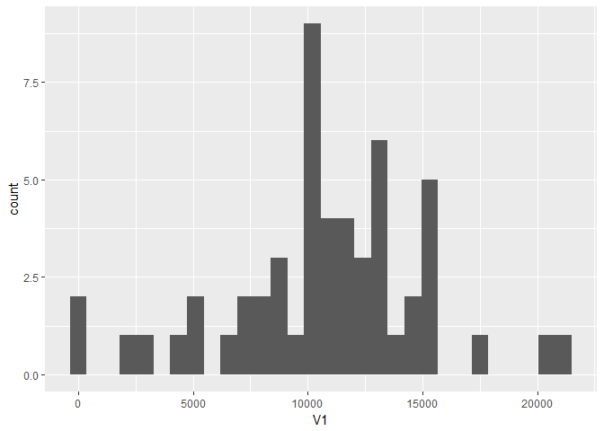

## Libraries

```r
library(data.table)
library(ggplot2)
```

## Loading and preprocessing the data

```r
#Load the data
original <- fread("activity.csv")

#NA number
naNumber <- sum(is.na(original$steps))

#Omit NA records
pmData <- na.omit(original)
```

## Data characteristics

```r
str(pmData)
```

```
## Classes 'data.table' and 'data.frame':	15264 obs. of  3 variables:
##  $ steps   : int  0 0 0 0 0 0 0 0 0 0 ...
##  $ date    : chr  "2012-10-02" "2012-10-02" "2012-10-02" "2012-10-02" ...
##  $ interval: int  0 5 10 15 20 25 30 35 40 45 ...
##  - attr(*, ".internal.selfref")=<externalptr>
```

```r
dim(pmData)
```

```
## [1] 15264     3
```

```r
summary(pmData)
```

```
##      steps            date              interval     
##  Min.   :  0.00   Length:15264       Min.   :   0.0  
##  1st Qu.:  0.00   Class :character   1st Qu.: 588.8  
##  Median :  0.00   Mode  :character   Median :1177.5  
##  Mean   : 37.38                      Mean   :1177.5  
##  3rd Qu.: 12.00                      3rd Qu.:1766.2  
##  Max.   :806.00                      Max.   :2355.0
```

```r
head(pmData)
```

```
##    steps       date interval
## 1:     0 2012-10-02        0
## 2:     0 2012-10-02        5
## 3:     0 2012-10-02       10
## 4:     0 2012-10-02       15
## 5:     0 2012-10-02       20
## 6:     0 2012-10-02       25
```

## What is total number of steps taken per day?

#Calculate the total number of steps taken per day

```r
stepsByDay <- pmData[,sum(steps),by = date]
```

#Make a histogram of the total number of steps taken each day

```r
qplot(V1, data=stepsByDay)
```

```
## `stat_bin()` using `bins = 30`. Pick better value with `binwidth`.
```

<!-- -->

#Calculate and report the mean and median of the total number of steps taken per day

```r
mean(stepsByDay$V1)
```

```
## [1] 10766.19
```

```r
median(stepsByDay$V1)
```

```
## [1] 10765
```

## What is the average daily activity pattern?
Make a time series plot (i.e. type = "l") of the 5-minute interval (x-axis) and the average number of steps taken, averaged across all days (y-axis)


```r
fiveMinIntervalAverages <- pmData[,mean(steps),by=interval]

# Make a time series plot
with(fiveMinIntervalAverages, plot(interval, V1, type="l", ylab="steps" ))
```

<!-- -->

```r
# 5-minute interval, on average across all the days in the dataset, with the maximum number of steps.

apply(fiveMinIntervalAverages, MARGIN = 2, function(x) max(x, na.rm=TRUE))
```

```
##  interval        V1 
## 2355.0000  206.1698
```

## Imputing missing values
## Total number of missing values in the dataset. it is calculated at the beginning, before removing NA rows.

```r
naNumber
```

```
## [1] 2304
```

##Devise a strategy for filling in all of the missing values in the dataset


## Are there differences in activity patterns between weekdays and weekends?
